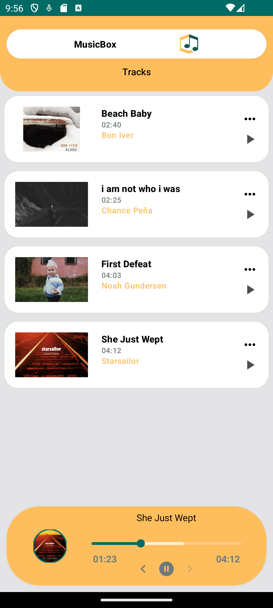
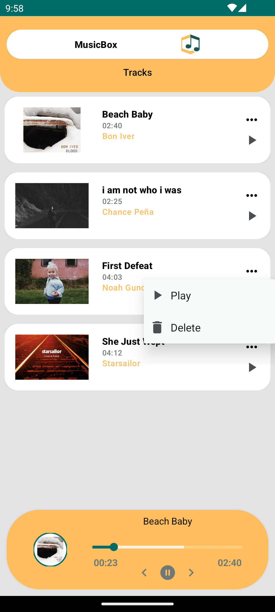
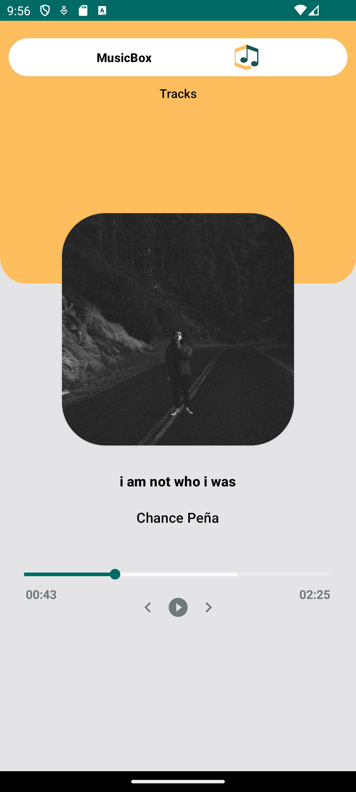
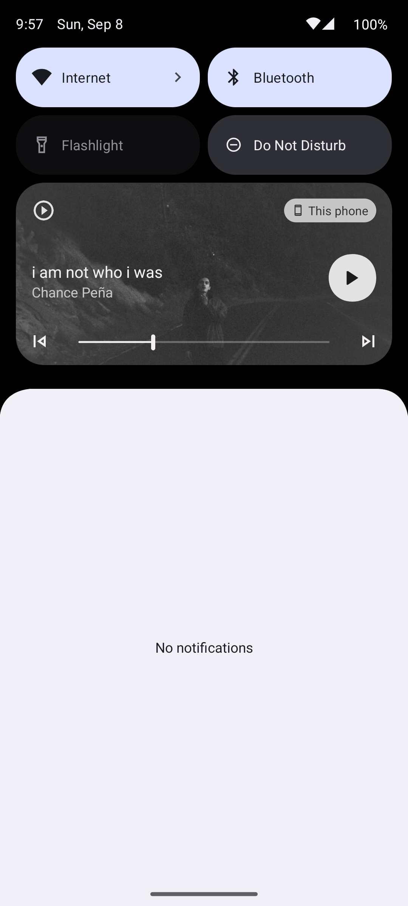

<h1 align="center"> Music Box </h1>
<br>
<p align="center">
    
</p>
Music Box is a local music player app that allows users to browse, play, and manage their music collection with an intuitive interface. Featuring media controls, a player bar, and song details with swipe navigation, Music Box offers a seamless music experience.
<br>
<br>


## Screenshots 

<p align="center">
  
    

<br>
    
  

</p>


## Demo
[](https://drive.google.com/file/d/1TGB-iLbjltV7gEI0Iv26cqsBPh0hN1-W/view?usp=drive_link)


[Show Demo Video](https://drive.google.com/file/d/1TGB-iLbjltV7gEI0Iv26cqsBPh0hN1-W/view?usp=drive_link)


## Features
* Local Music List: Displays all locally stored music from the device using the Media Store.
* Play & Delete Songs: Users can click on any song to start playback or delete unwanted songs from the list.
* Player Bar: A player bar is shown at the bottom of the screen during playback, providing quick access to music controls like play, pause, and skip.
* Detailed View: Clicking the player bar opens a detailed view of the currently playing song.
* ViewPager Navigation: Swipe left or right to move to the previous or next song easily.
* Playback Notifications: When a song is playing, a notification is shown with media controls (play, pause, skip) for easy access.

## Tech Stack

* Clean Architecture(MVVM)
* Single Activity
* Navigation Component
* Media3: Used for music playback.
* Hilt - Dependency Injection
* Media Store: Retrieves the list of local songs stored on the device.
* ViewPager: To swipe between songs in the detailed view.

## Getting Started
To get started with the WeatherApp, follow these steps:

1- Clone the repository:
```
   git clone https://github.com/AtefehTaheri/MusicBox.git
```
2- Open the project in Android Studio.<br>
3- Build and run the application on your emulator or device.

[](https://github.com/AtefehTaheri/MusicBox/releases/tag/v1.0)

or Get .APK : [Releases](https://github.com/AtefehTaheri/MusicBox/releases/tag/v1.0)
